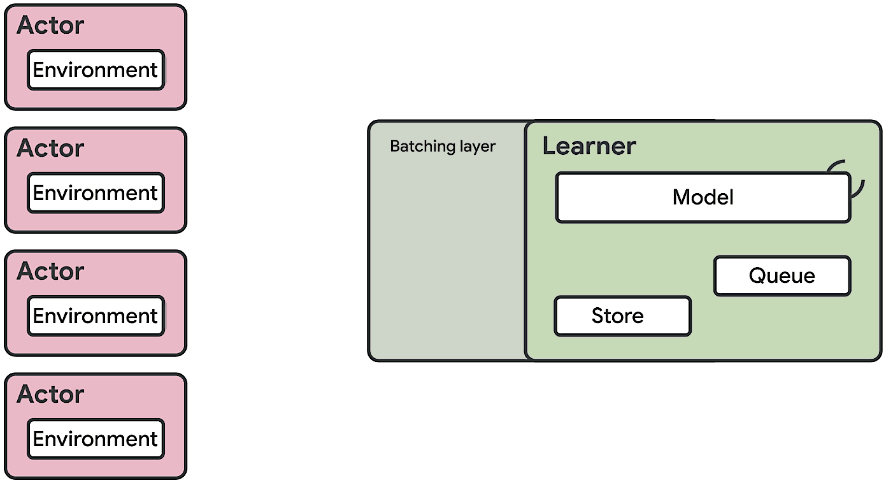

# SEED

This repository contains an implementation of distributed reinforcement learning
agent where both training and inference are performed on the learner.



Four agents are implemented:

- [IMPALA: Scalable Distributed Deep-RL with Importance Weighted Actor-Learner Architectures](https://arxiv.org/abs/1802.01561)

- [R2D2 (Recurrent Experience Replay in Distributed Reinforcement Learning)](https://openreview.net/forum?id=r1lyTjAqYX)

- [SAC: Soft Actor-Critic](https://arxiv.org/abs/1801.01290)

- [Configurable On-Policy Agent](https://arxiv.org/abs/1910.06591) implementing the following algorithms:
  - [Vanilla Policy Gradient](https://spinningup.openai.com/en/latest/algorithms/vpg.html)
  - [Proximal Policy Optimization Algorithms](https://arxiv.org/abs/1707.06347)
  - [V-trace](https://arxiv.org/abs/1802.01561)
  - [Advantage-Weighted Regression: Simple and Scalable Off-Policy Reinforcement Learning](https://arxiv.org/abs/1910.00177)
  - [V-MPO: On-Policy Maximum a Posteriori Policy Optimization for Discrete and Continuous Control](https://arxiv.org/abs/1909.12238)

The code is already interfaced with the following environments:

- [ATARI games](https://github.com/openai/atari-py/tree/master/atari_py)

- [DeepMind lab](https://github.com/deepmind/lab)

- [Google Research Football](https://github.com/google-research/football)

- [Mujoco](https://github.com/openai/gym/tree/master/gym/envs/mujoco)

However, any reinforcement learning environment using the [gym
API](https://github.com/openai/gym/blob/master/gym/core.py) can be used.

For a detailed description of the architecture please read
[our paper](https://arxiv.org/abs/1910.06591).
Please cite the paper if you use the code from this repository in your work.

### Bibtex

```
@article{espeholt2019seed,
    title={SEED RL: Scalable and Efficient Deep-RL with Accelerated Central Inference},
    author={Lasse Espeholt and Rapha{\"e}l Marinier and Piotr Stanczyk and Ke Wang and Marcin Michalski},
    year={2019},
    eprint={1910.06591},
    archivePrefix={arXiv},
    primaryClass={cs.LG}
}
```

## Pull Requests

At this time, we do not accept pull requests. We are happy to link to forks
that add interesting functionality.

## Prerequisites

There are a few steps you need to take before playing with SEED. Instructions
below assume you run the Ubuntu distribution.

- Install docker by following instructions at https://docs.docker.com/install/linux/docker-ce/ubuntu/.
  You need 19.03 version or later due to required GPU support.

- Make sure docker works as non-root user by following instructions at
  https://docs.docker.com/install/linux/linux-postinstall, section
  **Manage Docker as a non-root user**.

- Install git:

```shell
apt-get install git
```

- Clone SEED git repository:

```shell
git clone https://github.com/google-research/seed_rl.git
cd seed_rl
```

## Local Machine Training on a Single Level

To easily start with SEED we provide a way of running it on a local
machine. You just need to run one of the following commands:

```shell
./run_local.sh [Game] [Agent] [Num. actors]
./run_local.sh atari r2d2 4
./run_local.sh football vtrace 4
./run_local.sh dmlab vtrace 4
./run_local.sh mujoco ppo 4
```

It will build a Docker image using SEED source code and start the training
inside the Docker image.

## Distributed Training using AI Platform

Note that training with AI Platform results in charges for using compute resources.

The first step is to configure GCP and a Cloud project you will use for training:

- Install Cloud SDK following instructions at https://cloud.google.com/sdk/install
  and setup up your GCP project.
- Make sure that billing is enabled for your project.
- Enable the AI Platform ("Cloud Machine Learning Engine") and Compute Engine APIs.
- Grant access to the AI Platform service accounts as described at
  https://cloud.google.com/ml-engine/docs/working-with-cloud-storage.
- Cloud-authenticate in your shell, so that SEED scripts can use your project:

```shell
gcloud auth login
gcloud config set project [YOUR_PROJECT]
```

Then you just need to execute one of the provided scenarios:

```shell
gcp/train_[scenario_name].sh
```

This will build the Docker image, push it to the repository which AI Platform
can access and start the training process on the Cloud. Follow output of the command
for progress. You can also view the running training jobs at
https://console.cloud.google.com/ml/jobs

## DeepMind Lab Level Cache

By default majority of DeepMind Lab's CPU usage is generated by creating new
scenarios. This cost can be eliminated by enabling level cache. To enable it,
set the ```level_cache_dir``` flag in the ```dmlab/config.py```.
As there are many unique episodes it is a good idea to share the same cache
across multiple experiments.
For AI Platform you can add
```--level_cache_dir=gs://${BUCKET_NAME}/dmlab_cache```
to the list of parameters passed in ```gcp/submit.sh``` to the experiment.


## Baseline data on ATARI-57

We provide baseline training data for SEED's R2D2 trained on ATARI games in the
form of training curves (checkpoints and Tensorboard event files coming soon).
We provide data for 4 independent seeds run up to 40e9 environment frames.

The hyperparameters and evaluation procedure are the same as in section A.3.1 in
the [paper](https://arxiv.org/pdf/1910.06591.pdf).


### Training curves

Training curves are available on [this
page](https://github.com/google-research/seed_rl/tree/master/docs/r2d2_atari_training_curves.md).

### Checkpoints and Tensorboard event files

Checkpoints and tensorboard event files can be downloaded individually
[here](https://console.cloud.google.com/storage/browser/seed_rl_external_data_release)
or as [a single (70GBs) zip
file](https://storage.cloud.google.com/seed_rl_external_data_release/seed_r2d2_atari_checkpoints.zip).


## Additional links

SEED was used as a core infrastructure piece for the [What Matters In On-Policy Reinforcement Learning? A Large-Scale Empirical Study](https://arxiv.org/abs/2006.05990) paper.
A colab that reproduces plots from the paper can be found [here](https://github.com/google-research/seed_rl/tree/master/mujoco/what_matters_in_on_policy_rl.ipynb).
